# LAPORAN PRAKTIKUM
## Modul 4 - TUGAS MODUL

### KELOMPOK 12

---

# 1. Tujuan

1. Memahami konsep DMZ (Demilitarized Zone).
2. Memahami konfigurasi firewall menggunakan FortiGate.
3. Memahami implementasi NAT dan Port Forwarding.
4. Menghubungkan jaringan LAN, WAN, dan DMZ menggunakan beberapa perangkat jaringan.
5. Melakukan pengujian akses layanan web pada server DMZ dari jaringan WAN.

---

# 2. Topologi Jaringan

| Perangkat | Interface | IP Address |
|------------|------------|------------|
| MikroTik ISP | ether2 | 10.10.10.1/30 |
| FortiGate | port1 | 10.10.10.2/30 |
| FortiGate | port2 | 10.20.20.1/30 |
| Cisco Router | G0/0 | 10.20.20.2/30 |
| Cisco Router | G0/1 | 192.168.10.1/24 |
| Client LAN | eth0 | 192.168.10.10/24 |
| FortiGate | port3 | 192.168.20.1/24 |
| Ubuntu Server DMZ | ens3 | 192.168.20.10/24 |
| Client WAN | eth0 | 172.16.100.10/24 |
| MikroTik ISP | ether3 | 172.16.100.1/24 |

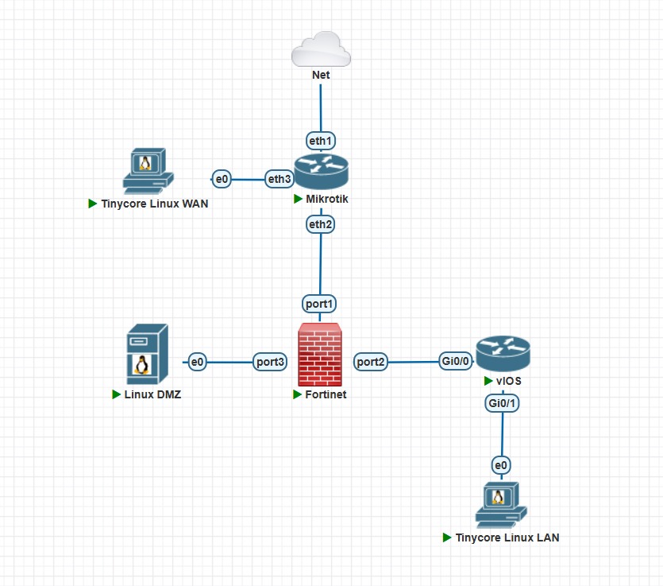

---

# 3. Konfigurasi MikroTik ISP

## DHCP Client

```bash
/ip dhcp-client add interface=ether1 disabled=no
```

## IP Address

```bash
/ip address add address=10.10.10.1/30 interface=ether2
/ip address add address=172.16.100.1/24 interface=ether3
```

## NAT

```bash
/ip firewall nat add chain=srcnat out-interface=ether1 action=masquerade
```

## Static Route

```bash
/ip route add dst-address=192.168.10.0/24 gateway=10.10.10.2
/ip route add dst-address=192.168.20.0/24 gateway=10.10.10.2
```

---

# 4. Konfigurasi FortiGate

## Konfigurasi Interface

```bash
config system interface

edit port1
set mode static
set ip 10.10.10.2 255.255.255.252
set allowaccess ping https ssh http
next

edit port2
set ip 10.20.20.1 255.255.255.252
set allowaccess ping
next

edit port3
set ip 192.168.20.1 255.255.255.0
set allowaccess ping
next

end
```

## Default Route

```bash
config router static

edit 1
set dst 0.0.0.0 0.0.0.0
set gateway 10.10.10.1
set device port1
next

end
```

## Route Menuju LAN

```bash
config router static

edit 2
set dst 192.168.10.0 255.255.255.0
set gateway 10.20.20.2
set device port2
next

end
```

---

# 5. Konfigurasi Cisco Router

Masuk mode konfigurasi:

```bash
enable
configure terminal
```

## Interface G0/0

```bash
interface GigabitEthernet0/0
ip address 10.20.20.2 255.255.255.252
no shutdown
exit
```

## Interface G0/1

```bash
interface GigabitEthernet0/1
ip address 192.168.10.1 255.255.255.0
no shutdown
exit
```

## Default Route

```bash
ip route 0.0.0.0 0.0.0.0 10.20.20.1
```

## Simpan Konfigurasi

```bash
copy running-config startup-config
```

---

# 6. Konfigurasi Client LAN

IP Address:

```text
IP Address : 192.168.10.10
Subnet Mask: 255.255.255.0
Gateway    : 192.168.10.1
DNS        : 8.8.8.8
```

Konfigurasi terminal:

```bash
ifconfig eth0 192.168.10.10 netmask 255.255.255.0 up
route add default gw 192.168.10.1
```

---

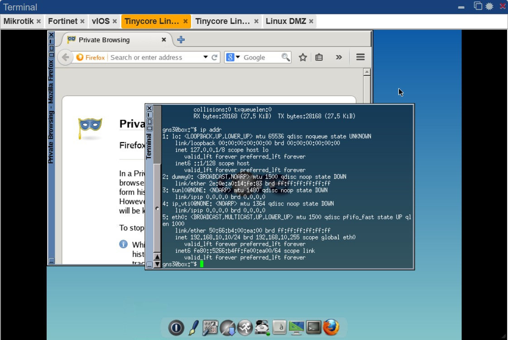

# 7. Konfigurasi Client WAN

IP Address:

```text
IP Address : 172.16.100.10
Subnet Mask: 255.255.255.0
Gateway    : 172.16.100.1
DNS        : 8.8.8.8
```

Konfigurasi terminal:

```bash
ifconfig eth0 172.16.100.10 netmask 255.255.255.0 up
route add default gw 172.16.100.1
```

---

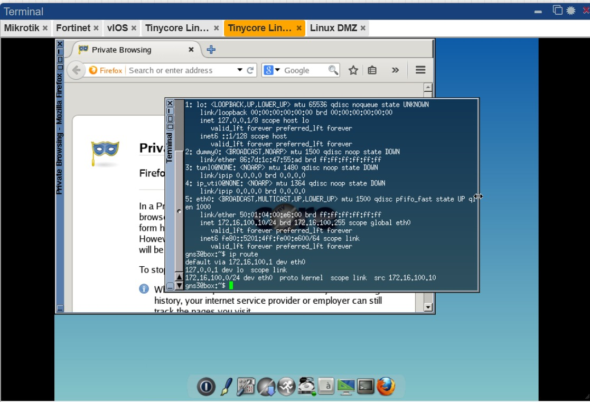

# 8. Konfigurasi Ubuntu Server DMZ

## Konfigurasi IP

```bash
ip addr add 192.168.20.10/24 dev ens3
ip route add default via 192.168.20.1
```

## DNS

```bash
echo "nameserver 8.8.8.8" > /etc/resolv.conf
```

## Install Nginx

```bash
apt update
apt install nginx -y
```

## Edit Halaman Web

```bash
nano /var/www/html/index.nginx-debian.html
```

Isi file:

```html
<h1>Tumod_4_DMZ_Firewall_12-Kelompok12</h1>
```


## Menjalankan Nginx

```bash
systemctl start nginx
systemctl enable nginx
```

---

# 9. Firewall Policy FortiGate

## LAN ke WAN

```bash
config firewall policy

edit 1
set name LAN_to_WAN
set srcintf port2
set dstintf port1
set srcaddr all
set dstaddr all
set action accept
set schedule always
set service ALL
set nat enable
next

end
```

## LAN ke DMZ

```bash
config firewall policy

edit 2
set name LAN_to_DMZ
set srcintf port2
set dstintf port3
set srcaddr all
set dstaddr all
set action accept
set schedule always
set service ALL
next

end
```

## VIP Port Forwarding

```bash
config firewall vip

edit VIP_DMZ
set extip 10.10.10.2
set mappedip 192.168.20.10
set portforward enable
set extport 80
set mappedport 80
next

end
```

## WAN ke DMZ

```bash
config firewall policy

edit 3
set name WAN_to_DMZ_HTTP
set srcintf port1
set dstintf port3
set srcaddr all
set dstaddr VIP_DMZ
set action accept
set schedule always
set service HTTP
next

end
```

---

# 10. Pengujian

## Pengujian Koneksi

### MikroTik ke FortiGate

```bash
ping 10.10.10.2
```

### Cisco ke FortiGate

```bash
ping 10.20.20.1
```

### Client LAN ke Server DMZ

```bash
ping 192.168.20.10
```

### Client WAN ke FortiGate

```bash
ping 10.10.10.2
```

---

## Pengujian Web Server

### Dari LAN

```text
http://192.168.20.10
```

### Dari WAN

```text
http://10.10.10.2
```

Hasil:

Web server berhasil diakses dan menampilkan halaman:

```text
Tumod_4_DMZ_Firewall_12-Kelompok12
```

---

# 11. Analisis

Pada praktikum ini dilakukan implementasi jaringan yang terdiri dari WAN, LAN, dan DMZ menggunakan MikroTik, FortiGate, Cisco Router, serta Ubuntu Server sebagai server DMZ. Konfigurasi routing dan firewall berhasil dilakukan sehingga komunikasi antar perangkat dapat berjalan sesuai dengan topologi yang telah dirancang.

Selama pelaksanaan praktikum terdapat beberapa kendala yang mempengaruhi proses pengujian. Kendala pertama terjadi pada Ubuntu Server yang berada di jaringan DMZ. Meskipun server telah terhubung ke jaringan dan dapat mengakses internet, proses instalasi Nginx tidak dapat dilakukan dengan baik. Kemungkinan penyebabnya adalah masalah pada repository Ubuntu, konfigurasi DNS, atau gangguan konektivitas menuju server repository. Akibatnya, layanan web yang seharusnya dijalankan pada DMZ tidak dapat diuji secara penuh.

Kendala kedua terjadi pada lingkungan simulasi PNETLab. Beberapa node Linux mengalami masalah saat dijalankan sehingga proses konfigurasi dan pengujian menjadi terhambat. Kondisi ini menyebabkan beberapa tahapan praktikum membutuhkan waktu lebih lama dibandingkan yang direncanakan. Faktor yang mungkin memengaruhi kondisi tersebut adalah keterbatasan sumber daya perangkat keras, penggunaan memori yang tinggi, atau gangguan pada proses virtualisasi.

Walaupun terdapat kendala pada Ubuntu Server dan PNETLab, konfigurasi perangkat jaringan utama seperti MikroTik, FortiGate, dan Cisco Router tetap dapat dilakukan dengan baik. Praktikum ini tetap memberikan pemahaman mengenai implementasi routing, firewall policy, NAT, serta segmentasi jaringan menggunakan DMZ untuk meningkatkan keamanan jaringan.

---

# 12. Kesimpulan

1. Praktikum berhasil memberikan pemahaman mengenai implementasi jaringan WAN, LAN, dan DMZ menggunakan MikroTik, FortiGate, Cisco Router, dan Ubuntu Server.
2. Konfigurasi routing statis, NAT, dan firewall policy pada FortiGate berhasil diterapkan sesuai dengan topologi yang dirancang.
3. DMZ berfungsi sebagai jaringan terpisah yang digunakan untuk menempatkan server agar dapat diakses dari jaringan luar tanpa memberikan akses langsung ke jaringan internal.
4. Ubuntu Server pada jaringan DMZ mengalami kendala saat melakukan instalasi Nginx meskipun telah terhubung ke internet sehingga pengujian layanan web tidak dapat dilakukan secara maksimal.
5. PNETLab mengalami masalah dalam menjalankan beberapa node Linux yang menyebabkan proses konfigurasi dan pengujian menjadi kurang optimal.
6. Meskipun terdapat kendala teknis selama praktikum, tujuan utama untuk mempelajari konsep DMZ, routing, NAT, dan firewall tetap dapat tercapai.

# 13. Dokumentasi Hasil Pengujian

## Topologi Jaringan


## Konfigurasi IP LAN


## Konfigurasi IP WAN


## MikroTik DHCP dan Routing
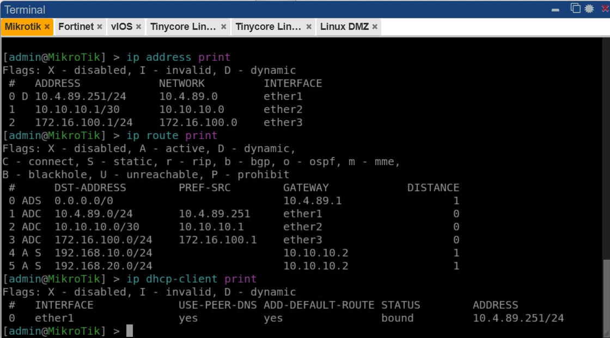

## Konfigurasi Interface FortiGate
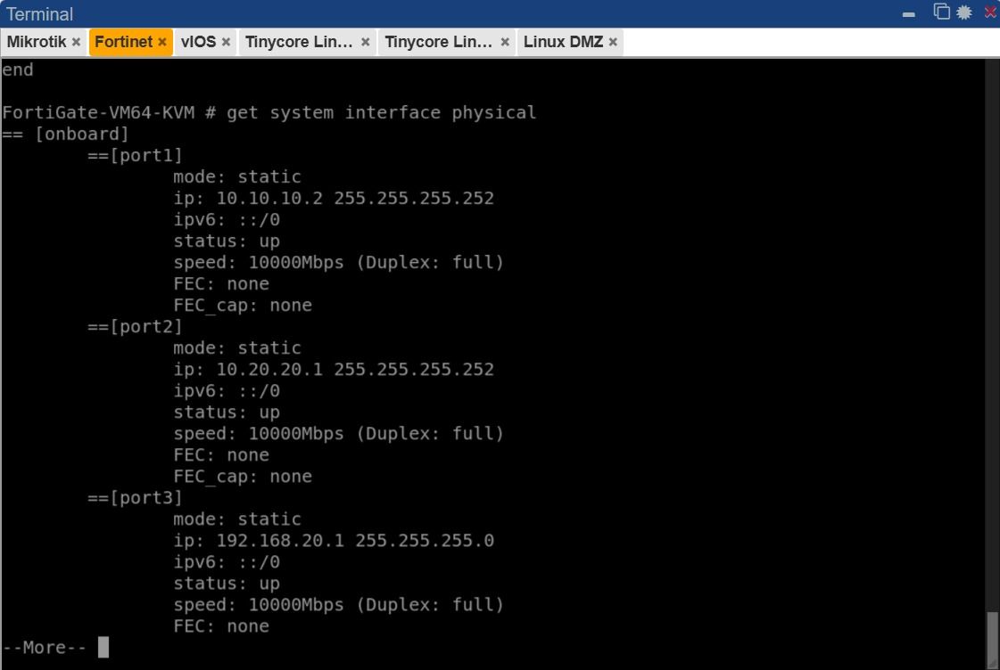

## Routing Table FortiGate
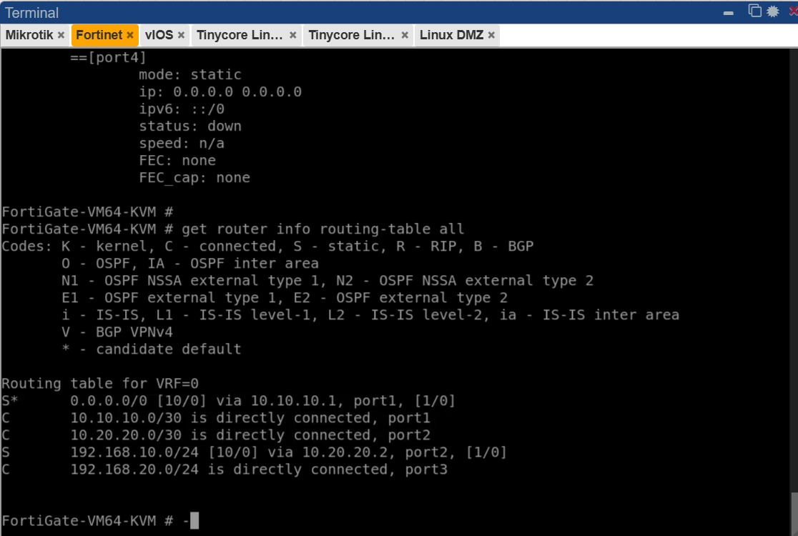

## Routing Table LAN
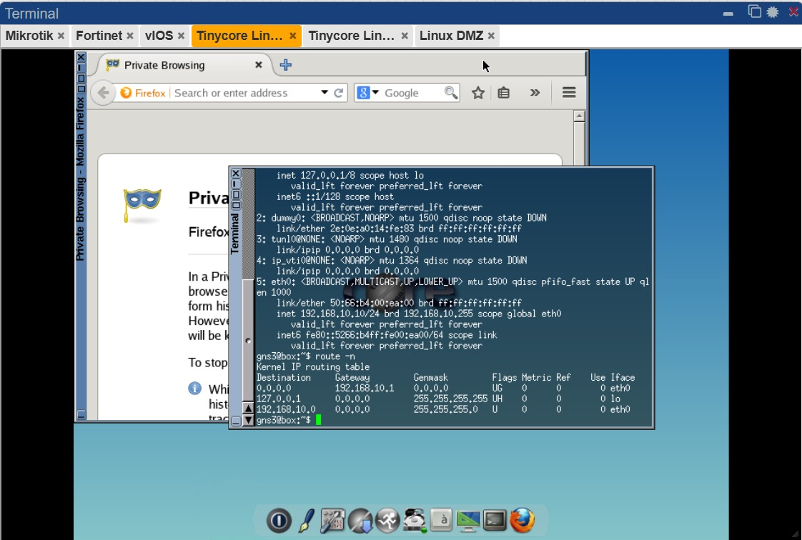

## Pengujian Ping Gateway DMZ
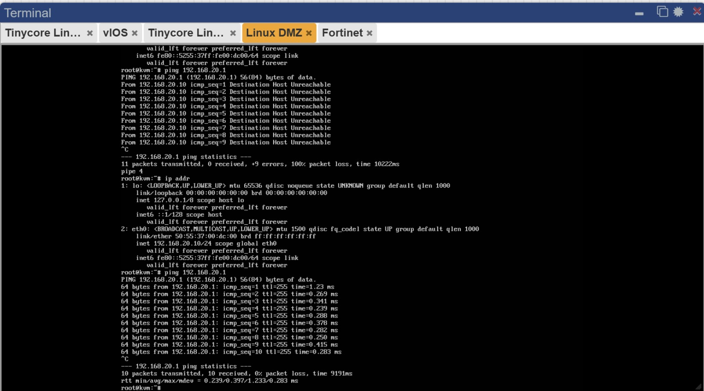

## Status Layanan Nginx pada DMZ
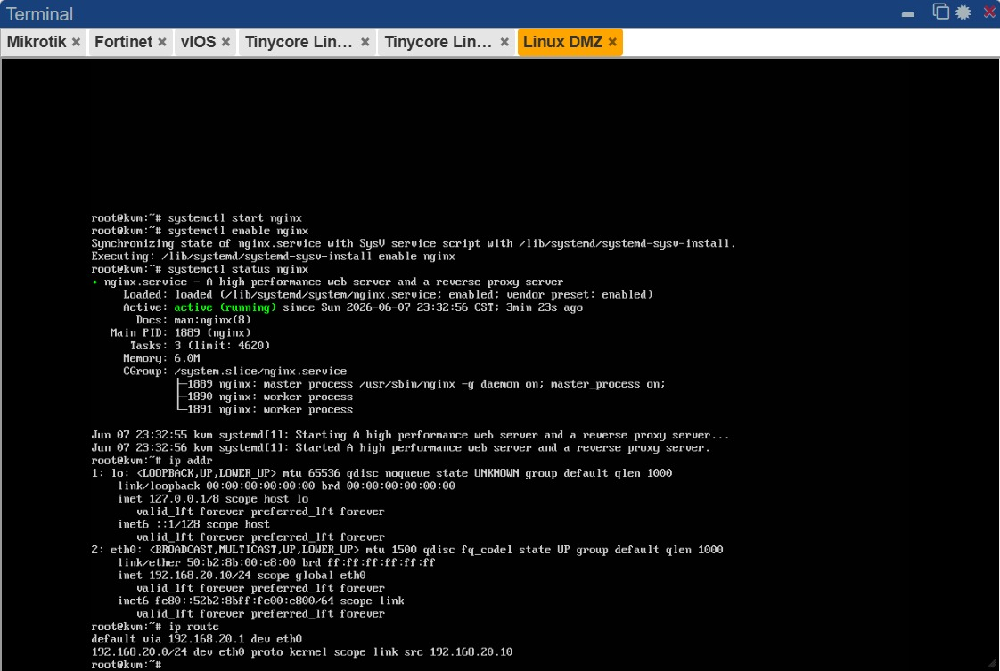

## Pengujian Ping dari LAN
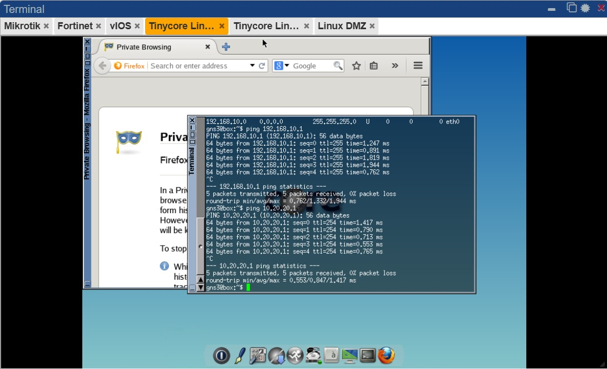

## Hasil Akhir Pengujian LAN
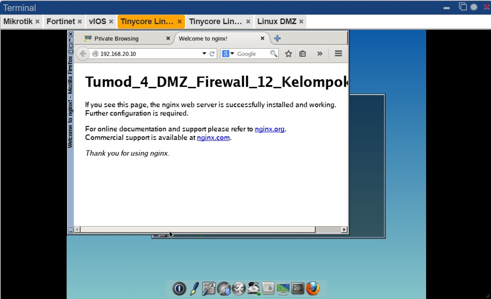

## Pengujian Ping dari WAN
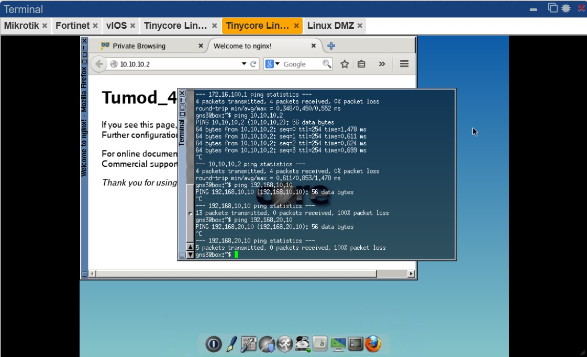

## Hasil Akhir Pengujian WAN
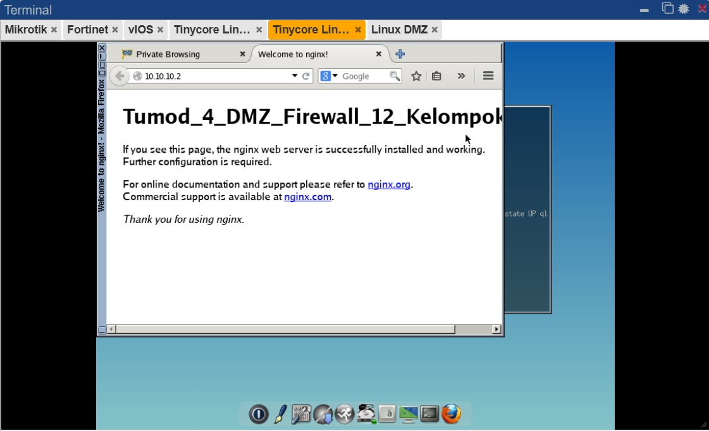

## Pengujian Routing Cisco Router
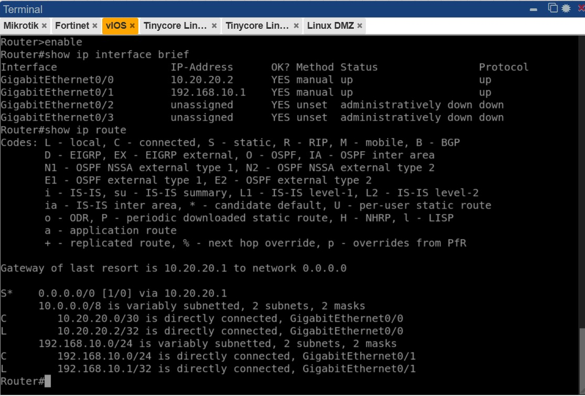
