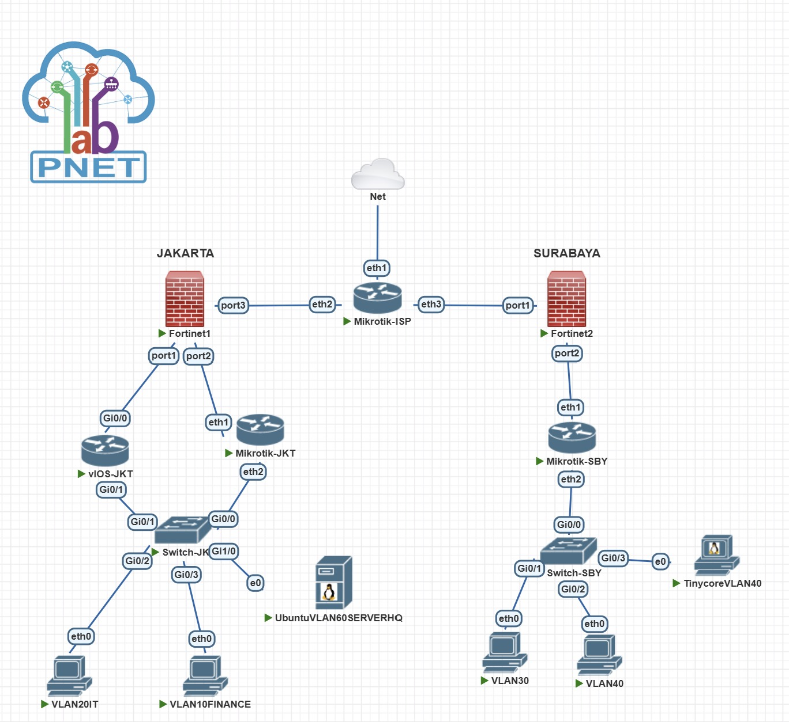
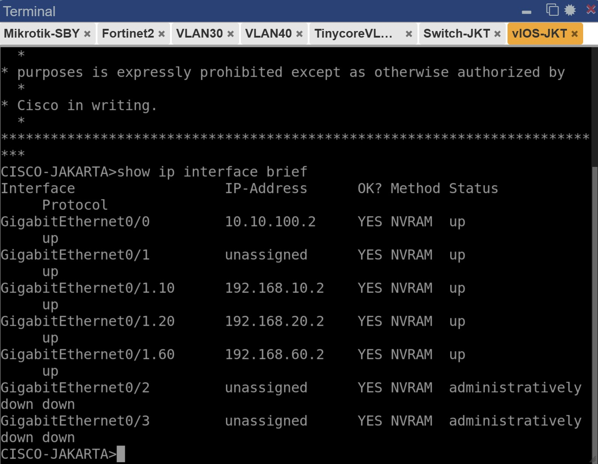
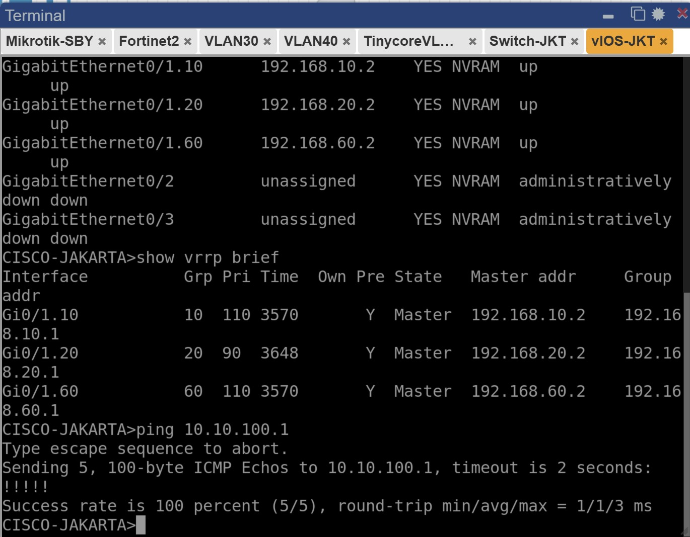

# LAPORAN TUGAS MODUL 5

Pada tugas modul ini, praktikan diperintahkan untuk membuat sebuah jaringan yang terdiri dari dua fortinet. Setiap fortinet berperan sebagai firewall untuk Kota Jakarta dan Kota Surabaya. Berikut merupakan detil pembuatan jaringan tersebut.

--------------------
## TOPOLOGI

Berikut merupakan Topologi dari jaringan yang akan dibuat. 

-----
## TUGAS 1 

Berikut merupakan hasil dari konfigurasi untuk Cisco Switch Jakarta

