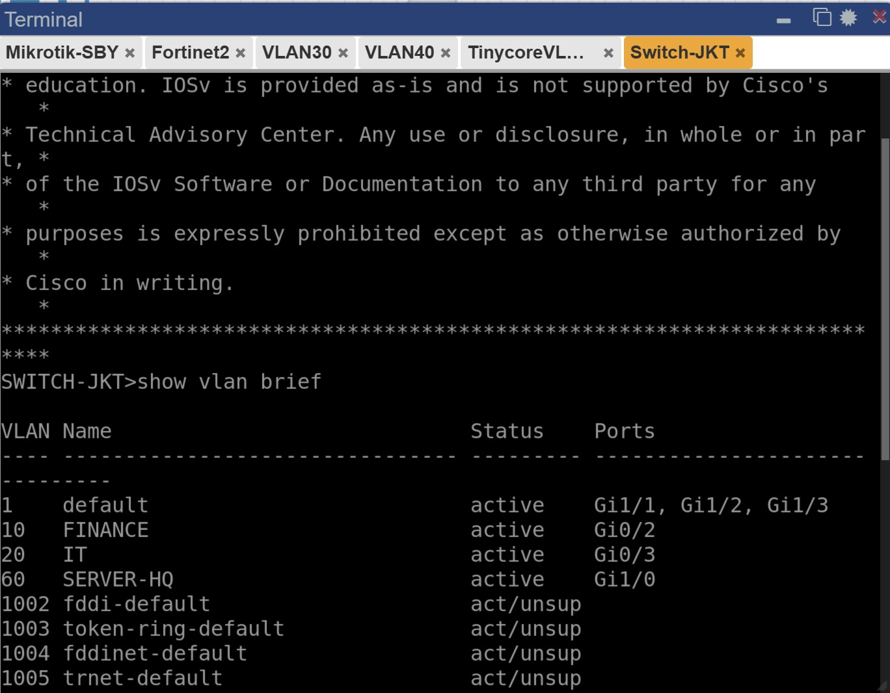
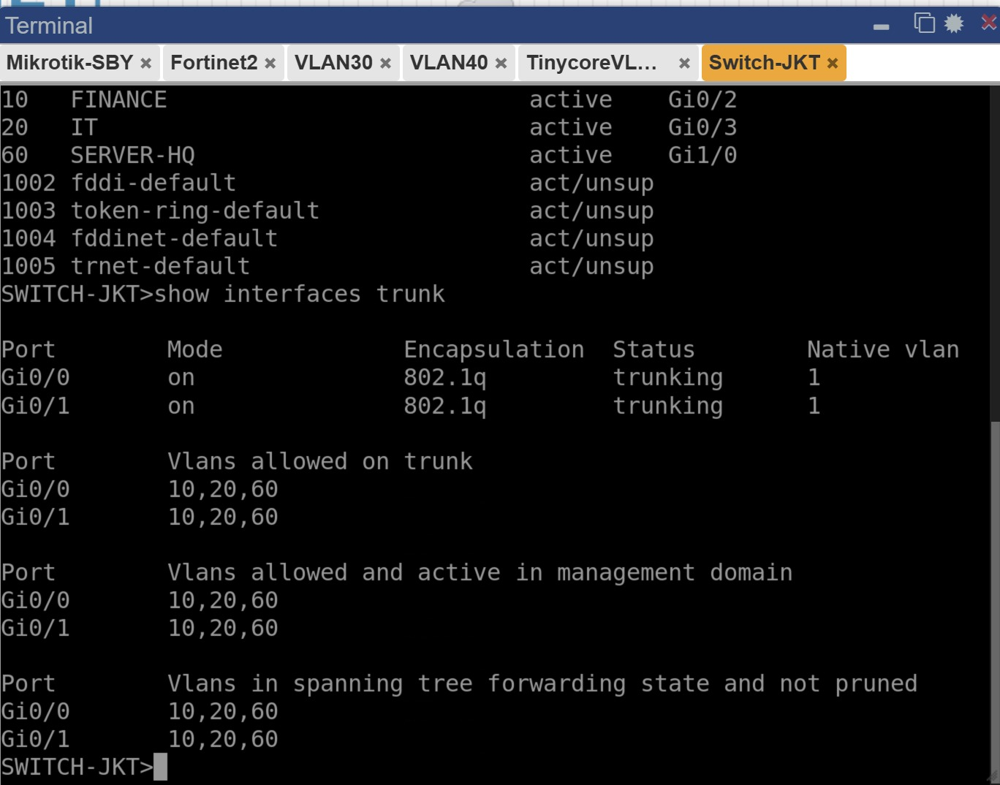
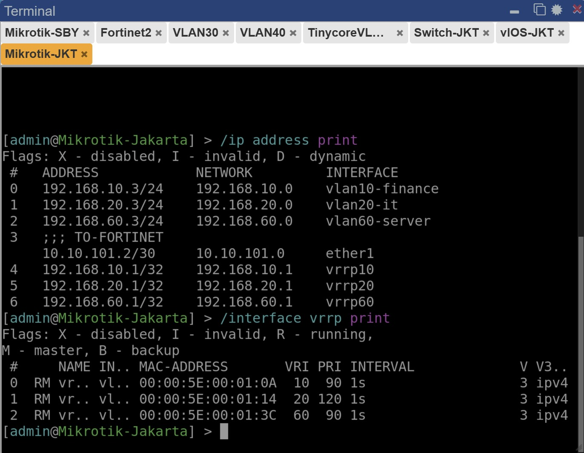
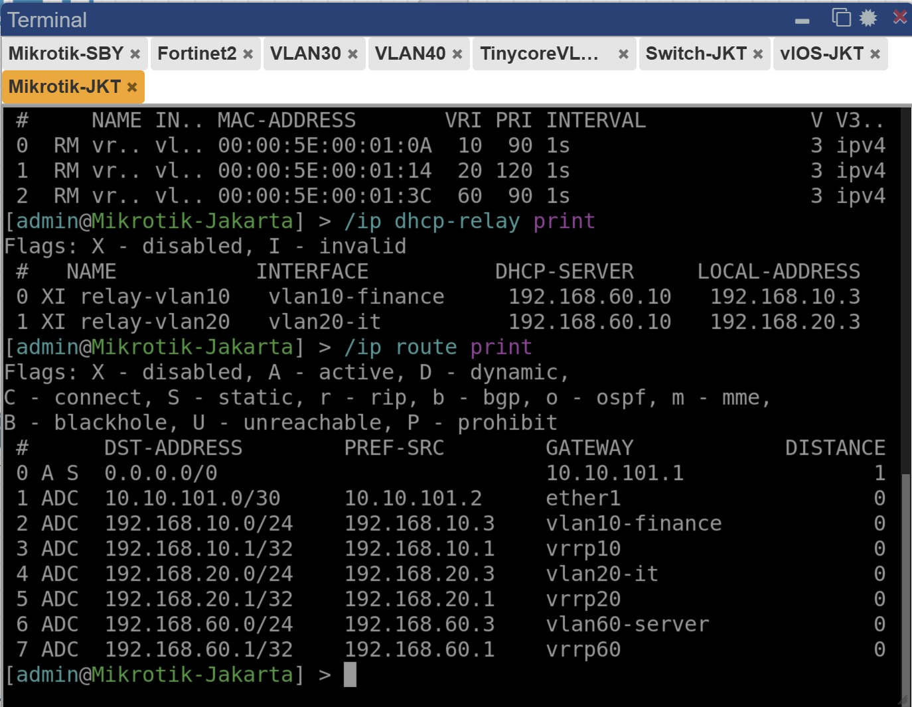
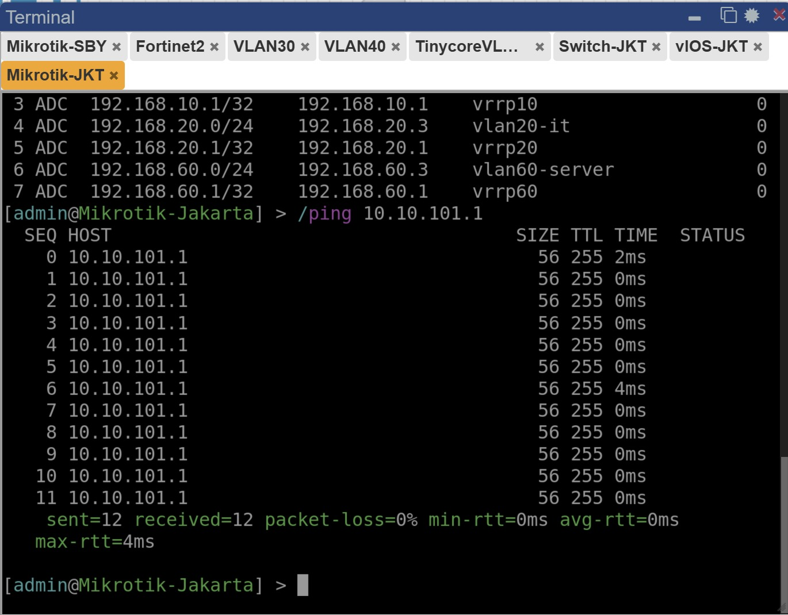

# LAPORAN TUGAS MODUL 5

Pada tugas modul ini, praktikan diperintahkan untuk membuat sebuah jaringan yang terdiri dari dua fortinet. Setiap fortinet berperan sebagai firewall untuk Kota Jakarta dan Kota Surabaya. Berikut merupakan detil pembuatan jaringan tersebut.

--------------------
## TOPOLOGI

Berikut merupakan Topologi dari jaringan yang akan dibuat. 

-----
## TUGAS 1 
Berikut merupakan hasil dari konfigurasi untuk Cisco Switch Jakarta

-----
## TUGAS 2
Berikut merupakan hasil dari konfigurasi untuk Cisco Router Jakarta

-----
## TUGAS 3
Berikut merupakan hasil dari 
* `ip address print`, 
* `interface vrrp print`, 
* `ip dhcp-relay print`, 
* `ip route print`, 
* Bukti hasil ping ke Fortigate.

untuk Switch Mikrotik Jakarta

-----
## TUGAS 4
Berikut merupakan hasil dari perintah 
* `ip a` 
* `ip` 
* `/etc/dhcp/dhcp.conf`
* `ping 8.8.8.8`

untuk Ubuntu Server Jakarta.

-----
## TUGAS 5
Berikut merupakan hasil dari perintah

* `get system interface physical`
* `get router info routing-table all`
* Firewall policy
* ping ke 8.8.8.8
* ping ke IP tunnel Surabaya
* `get router info ospf neighbor`
* `get router info routing-table ospf`
untuk FortiGate Jakarta

----
## TUGAS 6
Berikut merupakan hasil dari perintah

* `ip address print`
* `ip route print`
* `ip firewall nat print`
* `ping 8.8.8.8`
* ping antar WAN FortiGate

----
## TUGAS 7
Berikut merupakan hasil dari konfigurasi Switch dan Mikrotik Router Surabaya dengan perintah sebagai berikut.

* `show vlan brief`
* `show interface trunk`
* `ip address print`
* `ip dhcp-server print`
* `ip pool print`
* `ip route print`
* VPC VLAN 30 mendapatkan IP DHCP
* VPC ping ke 8.8.8.8

----
## TUGAS 8
Berikut merupakan hasil dari konfigurasi FortiGate Surabaya untuk perintah

* `get system interface physical`
* `get router info routing-table all`
* Firewall policy
* Ping ke 8.8.8.8
* ping ke IP Tunnel Jakarta
* `get router info ospf neighbor`
* `get router info routing-table ospf`

----
## TUGAS 9
Berikut merupakan hasil konfigurasi GRE Tunnel dan OSPF over GRE dengan ketentuan.

* Ping WAN antar FortiGate
* Ping tunnel antar FortiGate
* `get router info ospf neighbor`
* `get router info routing-table ospf`
* Ping client Jakarta ke client Surabaya
* Ping client Surabaya ke client Jakarta

----
## TUGAS 10
Berikut merupakan pengujian akhir dengan ketentuan

* IP DHCP client Jakarta VLAN 10
* IP DHCP client Surabaya VLAN 20
* Ping internet dari Jakarta
* Ping internet dari Surabaya
* Ping antar site
* Akses web server Jakarta dari Surabaya
* Routing table OSPF
* Analisis singkat jalur traffic Jakarta ke Surabaya

